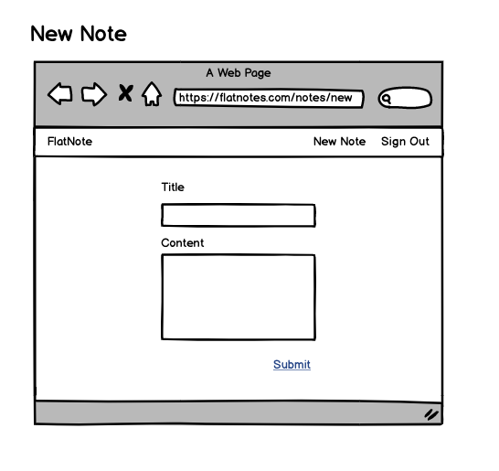
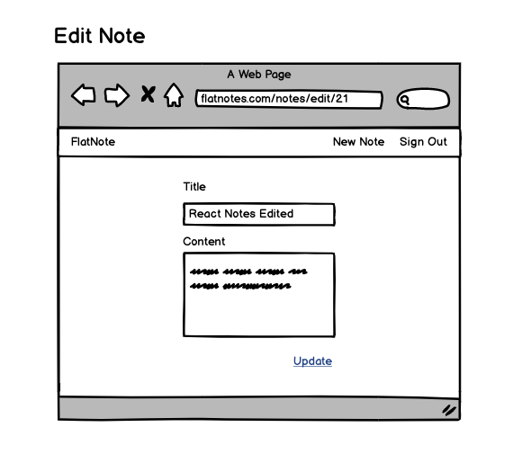

# Mod-4-Pilot-Project 

You've made it! You're ready to build a React application with Redux! Before you start ideating, think about some of the project requirements. 

## Flatnote

You've been through quite a few Project Modes by now and should have some idea how to think about scoping a project, what you can accomplish in the designated time, and what is expected of you in terms of meeting complexity requirements.

In the past, you've been responsible for determining the structure of your projects. This time, you are being given a directive - you will be creating a to-do list App called Flatnote. The wire-framing for your MVP has been provided for you below. Take a close look at all of the components that you'll need to build and begin thinking about how you might organize the structure of your App so that it has the following basic functionality:






## Requirements

In addition to using the above wire-frame to structure your App, your project should meet the following requirements:

- Use a _Rails API backend_ with a separate _React frontend_ that are created in two different Github repositories.
- Have at least three resources on the backend and your application. 
- You must have full CRUD actions for at least one resource (this will probably be your to-do item or note).
- Use Redux for site navigation
- Use React Router for site navigation(see routes on wire-frame for guidance with this)
- A sign-in page **note - this does not need to be a secure login - a user can sign in with just their username


If you create a fully functional MVP and have time left over, you may begin to work on stretch goals. Keep in mind that this is an excellent opportunity for you to practice using tools that you may want to incorporate into your Mod 5 project. Feel free to set your own goals or to attempt any of the following suggestions:

- **Strongly Recommended:** Style your App using basic CSS or by incorporating a CSS framework like Bootstrap, Semantic, Material UI, etc.
- Add the ability to filter by body, date created, date edited, etc.
- Sorting by date created, date edited, alphabetical, etc.
- Search and view notes with a certain tag 
- User signup & login
- Sharing notes with other users
- Rich text formatting
- Emailing notes
- Use google or facebook to login - *Check out [THIS](https://developers.google.com/identity/sign-in/web/sign-in) for help with incorporating this into your project*
- Incorporate a 3rd party API into your project.
      [It is highly suggested that any calls to 3rd party APIs are made _through your backend_.

        Example: A user clicks a button that says 'Get Gifs'
            * React makes a request to Rails
            * Rails makes a request to the Giphy API
            * Rails receives the response from Giphy and sends to React
            * React receives the response from Rails and you do something with it on the client

            This is so you can avoid any *CORS* issues. If you are unable to hit an API from your React app due to a CORS                 restriction, it is very likely that it is impossible to do so. _Brief Refresher on CORS: the idea is that from one              domain (the port your webpack development server is running on) you are not allowed to access another domain.                 You must make the request from a server (i.e. Rails), so the request is exempt from the Same-Origin Policy                      restriction._]
            
       


## Backend Setup
```
rails new <my-project> --api -T --database=postgresql
```

Let's go through this in detail:

* `--api`
  *  Make a [Rails 5 API](http://edgeguides.rubyonrails.org/api_app.html), basically you're telling Rails you don't want any of the stuff you wouldn't need for an application where Rails is not rendering views. Think the ActionView library (`form_for`, `link_to`, etc..), ERB, Security protections that ensure forms were rendered by the Rails app, things like that.
* `-T`
  * don't generate tests for this app
* `--database=postgresql`
  * Set this up to use a Postgres (as opposed to SQLite) database. If you ever want to push this to Heroku, Heroku requires a Postgres database. There won't be too much difference in how you have to write your code. You'll have to be sure to run `rails db:create` and make sure you have postgres running (i.e you can see the elephant)
* Be sure to do the necessary setup for the [rack-cors-gem](https://github.com/cyu/rack-cors)
* You may want to use [active-model-serializers](https://github.com/rails-api/active_model_serializers/tree/0-10-stable)

## Frontend Setup
To create your React project, you may use a tool called [create-react-app](https://github.com/facebookincubator/create-react-app), an awesome project generator developed by Facebook. To use this
+ `npm install -g create-react-app` - this installs the generator as a global package
+ In the directory where you'd like to create your project, `create-react-app my-project-client`. It's that simple!

We'd recommend to begin by removing any of the default stuff given to you by Create React App that you do not understand. The following are some really great resources on how to think about setting up a React project (_Spoiler: They both say the same thing, "There's no right answer!"_)
* [React Docs](https://github.com/reactjs/reactjs.org/blob/71788c647daa07392a8156609fdbede8e9ed24f7/content/docs/faq-structure.md) This was written by Dan Abramov himself <3 <3 <3....
* [The 100% Correct Way to Structure a React App (or why there’s no such thing)](https://hackernoon.com/the-100-correct-way-to-structure-a-react-app-or-why-theres-no-such-thing-3ede534ef1ed)

## Redux Setup
To setup Redux, these packages are required: redux, react-redux. Why? The answers are simple.
+ redux is the core that performs the magic 😄
+ By default, React bindings are not included in Redux. With react-redux, these bindings will be explicitly installed.
+ `npm install redux react-redux` - this installs Redux, React-Redux.


## Notes
By default both your client app and your rails app will run on port 3000. You'll have to specify one or the other to run on a separate port.
* Rails: `rails s -p <some_number_thats_not_3000>`
* React: Check out this [issue](https://github.com/facebookincubator/create-react-app/issues/1083)

A great article on how [DHH thinks about setting up controllers in Rails](http://jeromedalbert.com/how-dhh-organizes-his-rails-controllers/)
